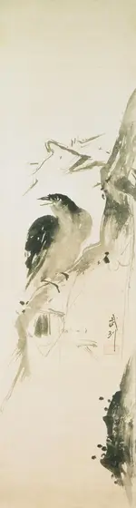

+++
title = "The Way towards Mastery"
date = "2025-09-17 18:00:00"
description = "Mastery isn't a collection of rules. It's a journey through the elements—from grounded foundations to the clarity of the ether. This is Miyamoto Musashi's lesson on transcending the form."

[taxonomies]
tags = ["growth", "career"]
+++

The theory is elegant. The performance on stage is clean.

But the real world is messy. It doesn’t reward theory; it rewards what works. This is the difference between the modern martial arts "master" who has never fought and the battle-hardened wisdom of a ronin like Miyamoto Musashi.

His path to mastery isn't a checklist. It's a journey through the elements.

First, you ground yourself in the **Earth**, building an unshakeable foundation. Then, you learn to be like **Water**, fitting into any situation without breaking. You learn to wield **Fire**, applying pressure at the right moment. You feel the **Wind**—the empty styles and distractions that try to sway you—and you hold your course.

Until finally, you pierce the clouds and enter the **Ether**.

Here, the rules don't matter. The mind is clear. You perform perfectly with whatever is available.

This is the heart of Musashi’s Way. It’s a place beyond surface forms, where wisdom, reason, and focus allow you to act. To do good against evil. To find the signal in the noise.

Stop collecting techniques.
Start the journey.

---

### The Shame of the Unused Sword

A samurai carried two swords: the long *katana* and the shorter *wakizashi*. While convention dictated using the katana with two hands and keeping the second blade in reserve, Musashi’s core principle of *Niten Ichi-ryu* ("Two Heavens, One School") rejected this limitation.

For him, it was a shame to die in a duel while your second sword remained untouched in its sheath. It represented the ultimate failure to use every tool at your disposal. This isn't just about swords. It’s about every skill, resource, and piece of knowledge you possess. Mastery demands using everything you have.

### The Fight Before the Art

Many modern martial arts have become a performance. A dance. They prioritize elegant forms over effectiveness, creating the illusion of mastery.

Musashi was a pragmatist. He lived in a world without points or referees. The only measure of a technique was its ability to win a fight. Everything else was a dangerous distraction.

He understood that true art is not the goal; it is the *byproduct* of a relentless focus on what works. When you master the fight so completely, your movements become so ruthlessly efficient that an observer might call them beautiful. But the master's focus was never on beauty. It was on the fight.

### The Way—from The Book of Five Rings

Musashi's elements are a sequential guide to learning anything.

*   **Earth (The Ground):** Master the fundamentals. Stop looking for shortcuts and learn your tools inside and out. This resembles what is now known as [First Principle Thinking](https://jamesclear.com/first-principles).
*   **Water (Adaptability):** Become fluid. Principles are more important than fixed techniques. When the plan fails, a master changes the plan, not the goal.
*   **Fire (Application):** Sharpen your skills under pressure. This is about timing, seizing the initiative, and applying your knowledge in the real world, not just in practice.
*   **Wind (Discernment):** Understand what doesn't work. Study the common mistakes and flawed logic in your field. Knowing why others fail is a powerful way to ensure you don't.
*   **Ether (Clarity):** This is the destination—a state of intuitive action. It's the state of flow earned through thousands of hours of *real* practice, where the right action happens without thought.

### A Note on the Source

These reflections are based on "The Complete Musashi" by Alexander Bennett. The book is essential because it presents all of Musashi's known works, from his early strategic writings to *The Book of Five Rings* and his final, stoic piece, *Dokkodo* ("The Way of Walking Alone").

Bennett’s historical-critical approach allows the reader to witness Musashi's transformation—from a relentless young duelist to a reflective master seeking the underlying principles of the Way. This cuts through the 20th-century nationalist propaganda that mythologized the samurai, revealing a human being in the honest pursuit of mastery.

---

An ink painting by Miyamoto Musashi — Bird on Branch, [Philadelphia Museum of Art](https://philamuseum.org/collection/object/64831):

