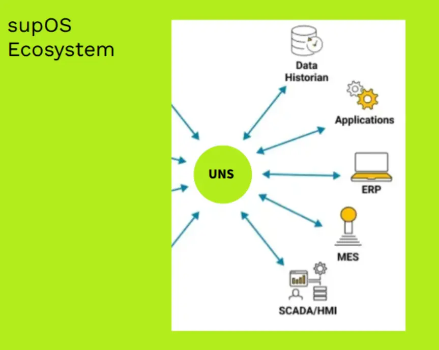
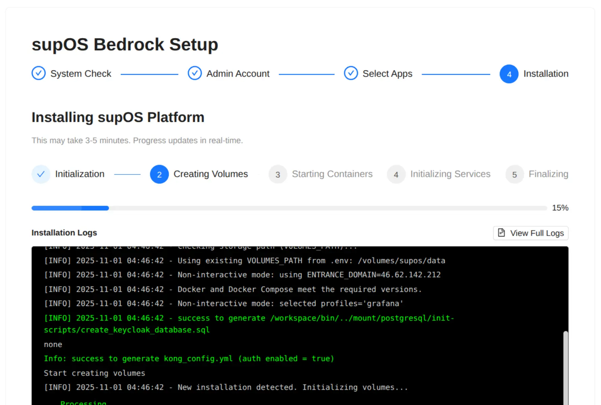
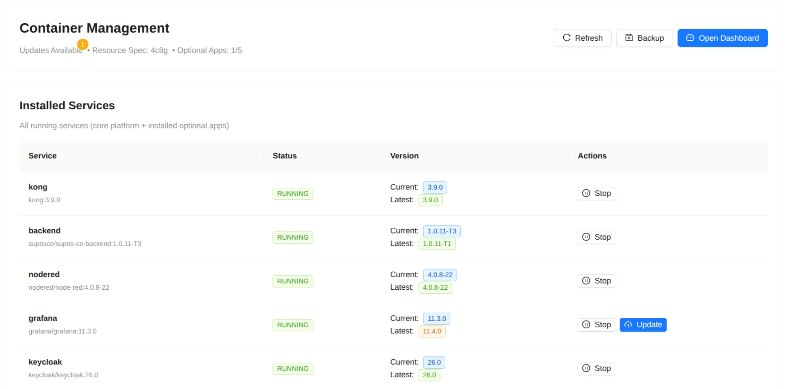

+++
title = "supOS Bedrock"
description = "Industrial IoT Orchestrator"
weight = 1
template = "page.html"

[taxonomies]
tags = ["career", "impact"]

[extra]
local_image = "projects/supos-bedrock/supos-bedrock.webp"
+++

## The Moment

Working as a system integrator, I spent most days fighting outdated tools.

Not building. Fighting.

Workarounds for proprietary software that doesn't talk to modern standards. Hours lost bridging gaps between systems that should connect seamlessly.

One day I stopped. Asked the obvious question.

**How to save time and make biggest impact?**

This leads to participation in supOS Global Hackathon 2025. Take a part in building the tool to shape the future of industrial processes.

<!-- more -->

{{ youtube(id="msySeDPDzdE") }}
*Full walkthrough: setup wizard, app installation, version updates, backup/restore*

## The Problem

Industry has "data spaghetti." Legacy systems everywhere. Unified Namespace exists as the solution—open standards, modern tools, proven architecture.

Nobody adopts it.

Not because the tools are bad. Because deployment is fragmented.

Too many services to install separately. Too many configs to maintain. Too much friction.


*The vision: supOS as platform foundation for industrial tools*

## The Insight

I looked at what actually succeeded.

Linux didn't win by being the best kernel. It won by being a platform. A foundation where tools live together.

Nextcloud didn't win by being the best file sync. It won by being an ecosystem. Install once, choose your apps.

They manage complexity once. Not per service.

**Current supOS installation:** Clone → edit configs → run scripts → debug → figure out updates yourself.

**What if it worked like [Nextcloud All-in-One](https://github.com/nextcloud/all-in-one)?** One command installs core. Web UI manages lifecycle.

That's what I built.

## What I Shipped

One Docker command deploys the orchestrator:

```bash
docker run -d \
  --name supos-bedrock \
  --restart always \
  -p 8080:8080 \
  -v /var/run/docker.sock:/var/run/docker.sock \
  -v /volumes/supos/data:/volumes/supos/data \
  -e HOST_IPS="$(hostname -I)" \
  leekaize/supos-bedrock:latest
```

Web wizard handles the rest:
- System checks (volumes, ports, IPs)
- Admin account creation
- Optional app selection
- Real-time installation logs
- Deploys 15+ services automatically


*Four-step wizard. Zero terminal commands.*

Post-installation, orchestrator becomes control plane:
- Version management via GitHub manifest
- One-click updates
- Install/uninstall apps
- Automated backups with Borg


*Container management showing version updates*

## How It Works

**Docker-in-Docker:** Orchestrator mounts `/var/run/docker.sock`. Controls host Docker daemon.

**Multi-stage build:** React frontend compiles to static assets. Python Flask serves everything.

**Dynamic composition:** Backend generates Docker commands with profiles. `--profile grafana` based on UI selections.

**Version control:** `builds.yaml` manifest from GitHub. Compare versions. Surface updates.

## The Impact

Orchestrator packages complexity into one system.

**For system integrators:** Standard deployment. One skillset across installations.

**For supOS ecosystem:** Lower adoption barrier. Developers build for the platform.

## What I Learned

**Packaging beats features.** Tools were already good. Adoption died on friction.

**Platform thinking scales.** Services are products. Ecosystems are platforms.

**First projects teach most.** Building in public forces clarity. Open source demands quality.

**Step back to see impact.** Fighting tools wastes time. Building better ones multiplies leverage.

## What's Next

v0.1 proved concept at hackathon. v0.2 targets production:

- Security hardening (disable defaults, RBAC)
- Full backup/restore (system configs, not just data)
- Standardized APIs (orchestrator ↔ supOS frontend)
- Migration tools (from supOS-CE)

## Try It

GitHub: [github.com/leekaize/supos-bedrock](https://github.com/leekaize/supos-bedrock)

One command in README. Runs on x86_64 or ARM64 with 4GB+ RAM.

Not production-ready. But functional enough to prove the path.

---

*Built for supOS Platform Hackathon, October 2025. My first open-source project—solving fragmentation in Industrial IoT.*